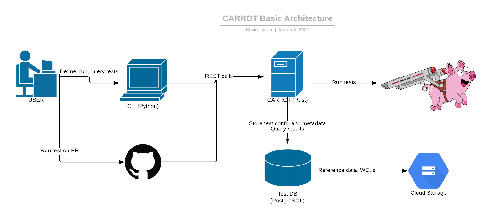

[1](#footnote1)


## Cromwell Automated Runner for Regression and Optimization Testing (CARROT) User Guide


### _v0.6.0_


## **Table of Contents**
* [Document Version Information](#document-version-information)
* [About](#about)
* [CARROT Introduction](#carrot-introduction)
    * [Backend Architecture](#backend-architecture)
* [HOWTO: Testing Software With CARROT](#howto-testing-software-with-carrot)
    * [CARROT Terms and Structure](#carrot-terms-and-structure)
        * [Software](#carrot-terms-and-structure-software)
        * [Result](#carrot-terms-and-structure-result)
        * [Pipeline](#carrot-terms-and-structure-pipeline)
        * [Template](#carrot-terms-and-structure-template)
        * [Test](#carrot-terms-and-structure-test)
        * [Run](#carrot-terms-and-structure-run)
    * [Pipeline / Analysis Design](#pipeline-analysis-design)
        * [WDL Requirements](#wdl-requirements)
            * [Permissions / Access](#permissions-access)
        * [Input Requirements](#input-requirements)
            * [Mapping Test Outputs to Eval Inputs](#mapping-test-outputs-to-eval-inputs)
            * [Specifying Custom Docker Images](#specifying-custom-docker-images)
    * [Setting Up Tests in CARROT](#setting-up-tests-in-carrot)
        * [CARROT CLI](#carrot-cli)
        * [Test Setup Process](#test-setup-process)
            * [1. Create an entry for your software in the CARROT database if it does not already exist](#1-create-an-entry-for-your-software-in-the-carrot-database-if-it-does-not-already-exist)
            * [2. Create new result types if necessary](#2-create-new-result-types-if-necessary)
            * [3. Create a new pipeline](#3-create-a-new-pipeline)
            * [4. Create a new template](#4-create-a-new-template)
            * [5. Map outputs to results](#5-map-outputs-to-results)
            * [6. Create the test](#6-create-the-test)
            * [7. Run the test using CARROT CLI](#7-run-the-test-using-carrot-cli)
        * [Concise Example](#concise-example)
        * [Debugging Failed Runs / FAQ](#debugging-failed-runs-faq)
            * [Interrogating Cromwell](#interrogating-cromwell)
            * [Changing a WDL didn’t change the error message from CARROT / Cromwell](#changing-a-wdl-didn’t-change-the-error-message-from-carrot-cromwell)
    * [Defining and Generating Reports](#defining-and-generating-reports)
        * [Report Definition Process](#report-definition-process)
            * [1. Prepare your Jupyter notebook](#1-prepare-your-jupyter-notebook)
                * [1a. Python 3](#1a-python-3)
                * [1b. Only certain libraries](#1b-only-certain-libraries)
                * [1c. A control block (optional)](#1c-a-control-block-optional)
                * [1d. Using data from CARROT](#1d-using-data-from-carrot)
            * [2. Define a Report in CARROT](#2-define-a-report-in-carrot)
            * [3. Map the Report to a Template](#3-map-the-report-to-a-template)
        * [Generating a Report](#generating-a-report)
* [GitHub Integration](#github-integration)
    * [Adding CARROT Integration to Your GitHub Repository](#adding-carrot-integration-to-your-github-repository)
    * [Starting a Test Run from GitHub](#starting-a-test-run-from-github)
    * [Starting a PR Comparison Run from Github](#starting-a-pr-comparison-run-from-github)
* [Appendix](#appendix)
    * [Further Documentation / Links](#further-documentation-links)


## <a name="document-version-information"/> **Document Version Information**

This document is only applicable to the following version of CARROT:


```
v0.6.0
```


## <a name="about"/> **About**

This document serves as a guide for how to interact with CARROT, including how to set up tests, link your github repo to CARROT, and interact with the server.  This guide does not cover how to set up the CARROT system - that topic is covered in another document.

Remember - “A full eval is just a #carrot() away.”


## <a name="carrot-introduction"/> **CARROT Introduction**

The Cromwell Automated Runner for Regression and Optimization Testing (CARROT) is a testing infrastructure designed to easily compare the correctness and performance between two versions of a software application or pipeline.


### <a name="backend-architecture"/> **Backend Architecture**

Test and evaluation execution on CARROT is performed using the Cromwell execution engine.  The tests and evaluations are written using Workflow Description Language (WDL).





CARROT can execute tests and evaluations from either a command-line interface or in GitHub via GitHub Actions.

The backend for CARROT’s execution is hosted entirely on Google Cloud Platform (GCP).


## <a name="howto-testing-software-with-carrot"/> **HOWTO: Testing Software With CARROT**

Because CARROT leverages WDL to describe tests, any software system can be tested with CARROT (including systems-of-systems).


### <a name="carrot-terms-and-structure"/> **CARROT Terms and Structure**

CARROT breaks down testing into several pieces that must be defined in the CARROT database in order to perform analyses (names bolded below).


#### <a name="carrot-terms-and-structure-software"/> **Software**

In CARROT, **software** represents a piece of software or software pipeline to test.  It is not strictly necessary to define a _software_ unit in order to define and run tests, but it is highly encouraged because of the benefits it affords.


#### <a name="carrot-terms-and-structure-result"/> **Result**

A **result** is an output type / class from a test or evaluation.  For example, this can be a bam file, a TSV file, a single value, an image, etc.  These result types are shared across all CARROT analyses, so when adding a new template, the result types for a particular analysis may already exist.  If not, they will need to be defined before adding a new template.


#### <a name="carrot-terms-and-structure-pipeline"/> **Pipeline**

A CARROT **pipeline** defines a unit on which analyses can be performed.  This unit can be a piece of software or several pieces of software connected together to perform a task to be analyzed.


#### <a name="carrot-terms-and-structure-template"/> **Template**

Each CARROT pipeline can have one or more **template**s associated with it.  A template defines a repeatable test and evaluation to be performed on the associated pipeline.  This test and evaluation are defined in WDL files and do not have inputs associated with them - rather they define a specific method to test and evaluate the pipeline which can be performed for multiple inputs.  This allows the template to be run multiple times with multiple inputs, but with the same evaluation method.


#### <a name="carrot-terms-and-structure-test"/> **Test**

A CARROT **test** is an instance of a template with inputs filled in.  Specifically, any inputs that define input data and / or ground truth data from which to create outputs and points of comparison for evaluation.  Typically all inputs will be defined in the test with the exception of the docker container that contains a specific software/pipeline version.  The typical use case is to vary the docker container for a fixed test so that the analysis can be tracked as new software versions are released.


#### <a name="carrot-terms-and-structure-run"/> **Run**

A **run** is an extension of a test that includes the docker container of the software to run and any other parameters specific to a software release.  This run is specified and then executed by CARROT producing **results** which then can be interpreted.

The relationship between **pipelines, templates, tests, runs**, and **results** can be seen below.


The following sections detail some specifics for how to use CARROT to create and dispatch analyses.  These sections refer to “tests” largely as notional concepts, rather than the CARROT **test** defined above.  In the future the terminology will be updated to be less ambiguous / confusing.


### <a name="pipeline-analysis-design"/> **Pipeline / Analysis Design**

Tests are designed to be fixed while software versions change.  This enables a constant “apples-to-apples” comparison with all previous and future versions of the software to be tested.  In practice, a test is fully defined once (i.e. input files, metrics, comparison methods, etc.) and then a specific version of the software is run using that test definition.  The results are stored in CARROT’s database to enable performance/correctness comparisons over subsequent (and even previous) software versions.

The best way to create tests for CARROT is to start with a WDL that already exists and correctly runs the software to be tested.  This WDL should be augmented to add in any metrics calculations required to evaluate the software.  We refer to this augmented WDL as the **_test WDL._**

In addition, another WDL should be written or adapted from existing tests which will run a comparison between the metrics outputs of the **_test WDL_** and precalculated baseline metrics.  We refer to this WDL as the **_evaluation WDL_**.

Alternatively you can leave the structure of your original tool WDL as-is, using it as the test WDL ([with some modifications detailed below](#wdl-requirements)), and implement all metrics creations and comparison in your evaluation WDL


#### <a name="wdl-requirements"/> **WDL Requirements**


##### <a name="permissions-access"/> **Permissions / Access**

If you supply any of the test resources (WDLs or their dependencies) via http/https/gs URI, the CARROT service account must have access to the WDLs and WDL resources to run for your test.  Because of this, <span style="text-decoration:underline;">you must make your WDLs and all associated required resources public or accessible by the service account that CARROT uses to retrieve and run WDLs</span>.


#### <a name="input-requirements"/> **Input Requirements**


##### <a name="mapping-test-outputs-to-eval-inputs"/> **Mapping Test Outputs to Eval Inputs**

It is encouraged to map outputs from your test WDL to inputs for your evaluation WDL.  To do so requires using a specific format for the value of the input supplied to your evaluation WDL.  For example, if your test WDL defines a workflow named “Test_Workflow”, which has an output called “output_vcf”, and you want to supply that as an input called “test_vcf” to a workflow called “Eval_Workflow” defined in your evaluation WDL, your input json for the evaluation WDL should contain the following:


```
"Eval_Workflow.test_vcf": "test_output:Test_Workflow.output_vcf"
```


##### <a name="specifying-custom-docker-images"/> **Specifying Custom Docker Images**

CARROT can generate a docker image to supply as an input to your test WDL or evaluation WDL.  It must be possible to generate the docker image by pulling from a GitHub repo and submitting it to [Google Cloud Build](https://cloud.google.com/build/docs/overview).  In order to use a custom docker image, first a **[software](#carrot-terms-and-structure)** record must be created in CARROT, either using the REST API or carrot_cli, that references the GitHub repository.  Once that is done, the custom build can be specified as an input to either your test WDL or your evaluation WDL.  For example, if you have created an entry for a software called “<code><em>my_cool_software</em></code>” and you want to generate a docker image from the commit with the hash “<code><em>ca82a6dff817ec66f44342007202690a93763949</em></code>” to supply to an input named “<code><em>docker_image</em></code>” in a workflow titled “<code><em>Test_Workflow</em></code>” in your test WDL, your test input json should contain the following:

`"Test_Workflow.docker_image":"image_build:my_cool_software|ca82a6dff817ec66f44342007202690a93763949`”


### <a name="setting-up-tests-in-carrot"/> **Setting Up Tests in CARROT**

Tests should be set up in CARROT using the [CARROT CLI](https://github.com/broadinstitute/carrot/tree/master/carrot_cli).


#### <a name="carrot-cli"/> **CARROT CLI**

Get the CARROT CLI by downloading the CLI archive from the [latest release](https://github.com/broadinstitute/carrot/releases) or cloning this git repository.  After downloading the CLI program, you must configure it to connect to the CARROT server:


```
> carrot_cli config set carrot_server_address <SERVER_ADDRESS>
```


You must also configure the CLI program to have your email so you can be alerted to when runs finish:


```
> carrot_cli config set email <YOUR_EMAIL_ADDRESS>
```


#### <a name="test-setup-process"/> **Test Setup Process**

Now that the CARROT CLI can connect to the CARROT server, you can complete the following steps to create and run your tests:


##### <a name="1-create-an-entry-for-your-software-in-the-carrot-database-if-it-does-not-already-exist"/> **1. Create an entry for your software in the CARROT database <span style="text-decoration:underline;">if it does not already exist:</span>**


```
> carrot_cli software create --name "<NAME>" --description "<DESCRIPTION>" --repository_url <GITHUB_URL> [--created_by EMAIL]
```


The `GITHUB_URL` should be the full HTTPS URL of the git repo as if you were going to clone it.  The `--created_by email` flag is optional and defaults to the email address in your carrot_cli configuration file.

If you attempt to create software that already exists in the CARROT database, the carrot_cli tool will return a 500 server error message.


##### <a name="2-create-new-result-types-if-necessary"/> **2. Create new result types if necessary:**

A result type is a notional class of data produced by the evaluation or test WDLs.  For example, all of the following are result types: ROC Curve Images (file), BAM File (file), Mean Coverage (floating point number), Read Name (string).

Your desired result types may already exist in CARROT, but if they do not, you may add them by entering the following:


```
> carrot_cli result create --name "<RESULT NAME>" --description "<DESCRIPTION>" --result_type <numeric|text|file> [--created_by EMAIL]
```


The `--created_by email` flag is optional and defaults to the email address in your carrot_cli configuration file.


##### <a name="3-create-a-new-pipeline"/> **3. Create a new pipeline:**

A pipeline is a way to group evaluations together.  All evaluation templates must be part of a pipeline.  To add a new pipeline, do the following:


```
> carrot_cli pipeline create --name "<PIPELINE NAME>" --description "<PIPELINE DESCRIPTION>" [--created_by EMAIL]
```


The `--created_by email` flag is optional and defaults to the email address in your carrot_cli configuration file.


##### <a name="4-create-a-new-template"/> **4. Create a new template:**

Every evaluation of a piece of software is itself based on a template that describes the software to be run and the evaluation to be performed on the outputs.  The template contains all of this information, but not necessarily the specifics about which version of the software to test, or which inputs to use directly.

To add a template to CARROT, do the following:


```
> carrot_cli template create --pipeline "<PIPELINE ID OR NAME>" --name "<TEMPLATE NAME>" --description "<DESCRIPTION>" --test_wdl "<PATH OR URI OF TEST WDL>" --eval_wdl "<PATH OR URI OF EVAL WDL>" [--created_by EMAIL]
```


The` pipeline` is the CARROT ID or name of the pipeline to which this template belongs.  If you just added a pipeline, the ID should still be visible at the command-line terminal as the result of `carrot_cli pipeline create … `.  If not, this can be found as the ID field when querying for pipelines (`carrot_cli pipeline find`).

The test and evaluation WDLs are specified here as local file paths or http/https/gs URIs to those WDLs.  If supplied via URIs, these WDLs must either be public or be accessible by the service account being used with your instance of CARROT.

The `--created_by email` flag is optional and defaults to the email address in your carrot_cli configuration file.


##### <a name="5-map-outputs-to-results"/> **5. Map outputs to results:**

For any output of a test or evaluation WDL to be tracked by CARROT, it must be mapped to a result type so CARROT can know how to treat it.  Outputs from your test and evaluation WDLs that you wish to track should be mapped to a result type.  Each output in a template can only be mapped to **one result**.  Therefore if you were to have two Receiver Operator Characteristic (ROC) curves produced by a single template - “ROC High” and “ROC Low” - it is recommended that you create two new results for them with corresponding names and use those as the mapped results.


```
> carrot_cli template  map_to_result TEMPLATE RESULT RESULT_KEY
```


The `TEMPLATE` corresponds to the CARROT ID or name of the template containing the output you wish to map to a result type.  If you just added a template, the ID should still be visible at the command-line terminal as the result of `carrot_cli template create …` .  If not, this can be found as the ID field when querying for pipelines (`carrot_cli template find`).

The `RESULT` corresponds to the CARROT ID or name of the result type which will be mapped to an output from the template.  The ID can be found as the ID field when querying for pipelines (`carrot_cli results find`).

`RESULT_KEY` is the name of the output from one of the WDLs in your template that you wish to track as a result in CARROT.  You can find your outputs in the output section of either the test or evaluation WDLs used in this template.


##### <a name="6-create-the-test"/> **6. Create the test:**

A test can be thought of as an instance of a template - one specific evaluation of a piece of software or software system.


```
> carrot_cli test create --name "<TEST NAME>" --template <TEMPLATE ID OR NAME> --description "<TEXT>" --test_input_defaults <TEST_WDL_DEFAULT_JSON_FILE> --eval_input_defaults <EVAL_WDL_DEFAULT_JSON_FILE> [--created_by EMAIL]
```


The  `TEMPLATE ID OR NAME` corresponds to the CARROT ID or name of the template containing the output you wish to map to a result type.  If you just added a template, the ID should still be visible at the command-line terminal as the result of `carrot_cli template create …` .  If not, this can be found as the ID field when querying for pipelines (`carrot_cli template find`).

`<TEST_WDL_DEFAULT_JSON_FILE> `corresponds to the JSON file containing default values for the test WDL.  In general, all workflow inputs should be set here except for the docker container specification (this is required for the GitHub integration to function properly).

`<EVAL_WDL_DEFAULT_JSON_FILE> `corresponds to the JSON file containing default values for the evaluation WDL.  In general, all workflow inputs should be set here except for the docker container specification (this is required for the GitHub integration to function properly).  If the evaluation WDL does not require a docker image input, you do not need to add a dummy value to the WDL prior to running the test.

The `--created_by email` flag is optional and defaults to the email address in your carrot_cli configuration file.


##### <a name="7-run-the-test-using-carrot-cli"/> **7: Run the test using CARROT CLI:**

Now that the test is set up, you can run the test from the command line or[ trigger the test from a GitHub repository](#starting-a-test-run-from-github).

To run a particular test from the CARROT CLI, do the following:


```
> carrot_cli test run [--name "<RUN NAME>"] --test_input <TEST_WDL_INPUT_JSON_FILE> --eval_input <EVAL_WDL_INPUT_JSON_FILE> [--created_by EMAIL] TEST
```


The` --name "<RUN NAME>"` flag is optional and will be populated by CARROT if a name is not supplied.

`<TEST_WDL_INPUT_JSON_FILE> `corresponds to the JSON file containing run-specific values for the test WDL.  Often the only thing required will be the docker container specification, though this is test-specific (this is required for the GitHub integration to function properly).

`<EVAL_WDL_INPUT_JSON_FILE> `corresponds to the JSON file containing run-specific values for the  evaluation WDL.

The `--created_by email` flag is optional and defaults to the email address in your carrot_cli configuration file.

The `TEST` field corresponds to the ID or name of the test to run.  If you just added a test, the ID should still be visible at the command-line terminal as the result of `carrot_cli test create …` .  If not, this can be found as the ID field when querying for pipelines (`carrot_cli test find`).


#### <a name="concise-example"/> **Concise Example:**

Following [the steps above](#test-setup-process), an example of adding in and running a subset of the GATK/DRAGEN functional equivalence tests (four single-sample comparisons) would be:


```
# Setup your carrot CLI configuration
carrot_cli config set carrot_server_address example.com/carrot

carrot_cli config set email user@example.com

# Add GATK to CARROT database
carrot_cli software create --name GATK --description "The Genome Analysis Toolkit" --repository_url https://github.com/broadinstitute/gatk.git

# Add result types to CARROT database
carrot_cli result create --name "ROC Curve Image" --description "An image file containing one or more ROC curves." --result_type file

carrot_cli result create --name "VCF File" --description "Variant Context file." --result_type file

carrot_cli result create --name "VCF Index" --description "Variant Context index file." --result_type file

carrot_cli result create --name "BAM Index" --description "BAM index file." --result_type file

carrot_cli result create --name "BAM file" --description "BAM file." --result_type file

carrot_cli result create --name "VCFEval Summary" --description "VCF Eval summary file." --result_type file

carrot_cli result create --name "VCFEval ROC Table" --description "ROC Table as produced by VCFEval." --result_type file

carrot_cli result create --name "VCFEval Quality Threshold" --description "Quality threshold as determined by VCFEval." --result_type numeric

carrot_cli result create --name "F Score" --description "F Score of an evaluation." --result_type numeric

carrot_cli result create --name "TSV" --description "Generic TSV file." --result_type file

# Add the HaplotypeCaller / DRAGEN tests as a pipeline
carrot_cli pipeline create --name "HaplotypeCaller DRAGEN Functional Equivalence" --description "Pipeline to capture the functional equivalence validation between HaplotypeCaller and DRAGEN."

# Create a template for the single sample HC / DRAGEN tests:
carrot_cli template create --pipeline_id "4b226df4-ea56-4c8e-b92b-1ceb001db712" --name "HaplotypeCaller DRAGEN Single Sample Comparison" --description "Comparing the results of HaplotypeCaller and DRAGEN for a single sample." --test_wdl https://storage.googleapis.com/dsp-methods-carrot-data/test_data/Dragen_GATK_Concordance/001_HC_Dragen_test.wdl --eval_wdl https://storage.googleapis.com/dsp-methods-carrot-data/test_data/Dragen_GATK_Concordance/002_HC_Dragen_eval.wdl

# Map the template outputs to CARROT result objects:
carrot_cli template  map_to_result 50d90287-bf31-46f8-888a-508567b0378d a7924abc-8327-4ae9-901a-f1a42e8447e8 HC_Dragen_eval.out_snp_plot

carrot_cli template  map_to_result 50d90287-bf31-46f8-888a-508567b0378d ed91e9df-edbd-4544-898f-4ad6ee3be0cc HC_Dragen_eval.out_table

carrot_cli template  map_to_result 50d90287-bf31-46f8-888a-508567b0378d 6619ab52-2aca-45a9-8de3-304260614147 HC_Dragen_eval.out_best_fscore

# Create four tests - one for each sample to compare:
carrot_cli test create --name "HaplotypeCaller DRAGEN WGS1" --template_id 50d90287-bf31-46f8-888a-508567b0378d --description "Comparison of GATK HaplotypeCaller with DRAGEN on WGS sample 1 (downsampled)." --test_input_defaults 001_HC_Dragen_test.WGS1.defaults.json --eval_input_defaults 002_HC_Dragen_eval.WGS1.defaults.json

carrot_cli test create --name "HaplotypeCaller DRAGEN WGS2" --template_id 50d90287-bf31-46f8-888a-508567b0378d --description "Comparison of GATK HaplotypeCaller with DRAGEN on WGS sample 2 (downsampled)." --test_input_defaults 001_HC_Dragen_test.WGS2.defaults.json --eval_input_defaults 002_HC_Dragen_eval.WGS2.defaults.json

carrot_cli test create --name "HaplotypeCaller DRAGEN WGS3" --template_id 50d90287-bf31-46f8-888a-508567b0378d --description "Comparison of GATK HaplotypeCaller with DRAGEN on WGS sample 3 (downsampled)." --test_input_defaults 001_HC_Dragen_test.WGS3.defaults.json --eval_input_defaults 002_HC_Dragen_eval.WGS3.defaults.json

carrot_cli test create --name "HaplotypeCaller DRAGEN WGS4" --template_id 50d90287-bf31-46f8-888a-508567b0378d --description "Comparison of GATK HaplotypeCaller with DRAGEN on WGS sample 4." --test_input_defaults 001_HC_Dragen_test.WGS4.defaults.json --eval_input_defaults 002_HC_Dragen_eval.WGS4.defaults.json

carrot_cli test run --test_input 001_HC_Dragen_test.WGS1.json --eval_input 002_HC_Dragen_eval.WGS1.json abcf78d5-e9f2-498b-bf8f-baa7771e5e87

carrot_cli test run --test_input 001_HC_Dragen_test.WGS2.json --eval_input 002_HC_Dragen_eval.WGS2.json 16743fd2-e958-4bd0-bf27-3a296f0a6cad

carrot_cli test run --test_input 001_HC_Dragen_test.WGS3.json --eval_input 002_HC_Dragen_eval.WGS3.json 12567eea-e186-452f-bf74-007181690420

carrot_cli test run --test_input 001_HC_Dragen_test.WGS4.json --eval_input 002_HC_Dragen_eval.WGS4.json 115240c1-e791-4cc5-ace3-e62d65749a84
```


#### <a name="debugging-failed-runs-faq"/> **Debugging Failed Runs / FAQ**


##### <a name="interrogating-cromwell"/> **Interrogating Cromwell**

When a run in CARROT fails, often it has proceeded far enough to have a Cromwell run ID associated with it.  If this is the case, you can look directly at the Cromwell failure by interrogating the Cromwell server using the Swagger Web API or by using a tool like [cromshell](https://github.com/broadinstitute/cromshell).  If you choose to use cromshell you must ensure that the cromshell server configuration file in `~/.cromshell/cromwell_server.config` points to the cromwell server that CARROT is using (including the correct port on which to communicate).


##### <a name="changing-a-wdl-didn’t-change-the-error-message-from-carrot-cromwell"/> **Changing a WDL didn’t change the error message from CARROT / Cromwell**

If your WDL is hosted in a google bucket it may be cached before it is run by CARROT.  If a WDL with an error is cached, then even after you reupload that WDL to a bucket, it may continue to use the incorrect cached version.

If this occurs, you can either wait for the cache to refresh or update the template with a location for the new WDL using the `carrot_cli template update `command.  Then you can run the test again.


### <a name="defining-and-generating-reports"/> **Defining and Generating Reports**

Jupyter Notebook reports can be generated from successful runs or [groups of runs from Github PR comparisons](#starting-a-pr-comparison-run-from-github).  These reports serve as visualizations of the CARROT run results and should be created to display relevant data in a readable, straight-forward manner.  They can be generated either automatically (when a run finishes successfully) or manually.

Before a report can be generated, it must be defined by the user.


#### <a name="report-definition-process"/> **Report Definition Process**

Listed here are the steps for defining a report using carrot_cli.


##### <a name="1-prepare-your-jupyter-notebook"/> **1. Prepare your Jupyter notebook**

If you have a Jupyter notebook you want to use as a report, there is some preparation that is necessary before it can be used within CARROT.  It must meet the following requirements:


###### <a name="1a-python-3"/> **1a. Python 3**

CARROT currently only supports Jupyter notebooks that are compatible with Python 3 (specifically Python 3.8.5).


###### <a name="1b-only-certain-libraries"/> **1b. Only certain libraries**

Only certain python libraries are currently supported within the CARROT reporting functionality.  There are plans to expand this list in the future.  To see the libraries that are installed, see the Dockerfile being used to generate reports [here](https://github.com/broadinstitute/carrot/blob/master/scripts/docker/reports/Dockerfile).   This can  be mitigated by using the Jupyter syntax to install new packages before using them:


```
    import sys
    !{sys.executable} -m pip install <MODULE_NAME>
```


###### <a name="1d-using-data-from-carrot"/> **1c. Using data from CARROT**

When the report is generated, CARROT will supply the data for the run(s) in a series of CSV files that should be opened within your Jupyter Notebook in order to access the data.  The following CSV files will be included:

* metadata.csv - contains a row for each run with metadata for that row (rund_id, name, test_id, status, cromwell ids, created_at, created_by, finished_at, and errors)
* test_inputs.csv - contains a row for each run with its run id and the contents of the test_input json for that run, with input names as column headers
* eval_inputs.csv - contains a row for each run with its run id and the contents of the eval_input json for that run, with input names as column headers
* test_options.csv - contains a row for each run with its run id and the contents of the test_options json for that run, with option names as column headers
* eval_options.csv - contains a row for each run with its run id and the contents of the eval_options json for that run, with option names as column headers
* results.csv - contains a row for each run with its run id and the contents of the results json for that run, with the result names as column headers

If you would like to download these files to use them locally and experiment with your notebook definition before defining the Report in CARROT, you can use the `--zip_csv` option in any of the `find_runs` commands or the `run find_by_id` command in carrot_cli.  For example:

```
carrot_cli template find_runs "My cool template" --zip_csv run_data_csvs.zip
```


##### <a name="2-define-a-report-in-carrot"/> **2. Define a Report in CARROT**

Once you’ve finished preparing your notebook, it’s time to submit it to CARROT, where it will live as a Report.  A Report, as an entity within CARROT, defines the template that will be filled with a run’s data to generate a filled report file.  A Report can be created using the following command:


```
carrot_cli report create --name "<REPORT NAME>" [--description "<TEXT>"] --notebook <NOTEBOOK_FILE> [--config <CONFIG_JSON_FILE>] [--created_by EMAIL]
```


`<REPORT NAME>` is used to specify a unique name for the report within CARROT.

The `--description "<TEXT>"` flag allows you to optionally specify a description for the report for your reference.

`<NOTEBOOK_FILE> `corresponds to the notebook you prepared in [step 1](#1-prepare-your-jupyter-notebook) that will be filled with run data to generate a filled report.

The `--config <CONFIG_JSON_FILE> `flag allows you to specify (in a JSON file) a number of configuration parameters which will be used in the WDL that is run to generate the report.  The allowed parameters are a subset of the parameters [here](https://cromwell.readthedocs.io/en/stable/RuntimeAttributes/).  The parameters supported by CARROT are : `cpu, memory, disks, docker, maxRetries, continueOnReturnCode, failOnStderr, preemptible, `and` bootDiskSizeGb`.

The `--created_by email` flag is optional and defaults to the email address in your carrot_cli configuration file.


##### <a name="3-map-the-report-to-a-template"/> **3. Map the Report to a Template**

A report must be mapped to a template in order for filled reports to be generated from runs of that template.  Mapping a report to a template can be done with the following command:


```
carrot_cli template map_to_report [--created_by EMAIL] TEMPLATE REPORT [REPORT_TRIGGER]
```


The `--created_by email` flag is optional and defaults to the email address in your carrot_cli configuration file.

`TEMPLATE` is the ID or name of the template you wish to map.  If you need to find the ID of a specific template, you can get it using  `carrot_cli template find.`


`REPORT` is the ID or name of the report you wish to map.  If you just completed step 2 and created a report, the ID of that report should have been included in the results from that command.  If not, you can find the report using `carrot_cli report find`.

`REPORT_TRIGGER` is an optional argument that corresponds to the event that should trigger the generation of the report.  It defaults to `single`, which means a report will be generated upon successful completion of a single run of a test based on the template.  The other option is `pr`, which means a report will be generated upon successful completion of a [PR Comparison run](#starting-a-pr-comparison-run-from-github).


#### <a name="generating-a-report"/> **Generating a Report**

Filled reports can be generated in two ways. First, if a report has been properly defined and mapped to a template, any future successful runs of tests based on that template will automatically result in the report being generated, and any users subscribed to the pipeline, template, or test, or who created the run, will received an email notification when the report has been generated.  Additionally, if the run is triggered via a GitHub comment, the results of the report run will also be posted as a comment below it.

The second option, if you want to generate a report for a run that has already completed, is to do it manually via the following command:


```
carrot_cli run create_report [--created_by EMAIL] [--delete_failed] RUN REPORT
```


The `--created_by email` flag is optional and defaults to the email address in your carrot_cli configuration file.

The optional `--delete_failed `flag will overwrite an existing failed run_report record if there is one for the specified run and report.  Without this flag, the command will fail if there exists a record of a failed attempt at generating this report for this run.  Regardless of whether this flag is used, the command will fail if there is a non-failed run_report record for the specified run and report.

`RUN` is the ID or name of the run for which you wish to generate a report.  If you need to find the ID of a specific run, you can get it using any of the following commands:  `carrot_cli pipeline find_runs, carrot_cli template find_runs, or carrot_cli test find_runs`.


`REPORT` is the ID or name of the report you wish to generate for the run.  If you just completed step 2 above and created a report, the ID of that report should have been included in the results from that command.  If not, you can find the report using `carrot_cli report find`.

Once the report has been generated, it will be available in 3 forms: the Jupyter notebook that is produced by CARROT before being run, the filled Jupyter notebook that is created once all the cells are run, and a static HTML representation of the filled notebook.


## <a name="github-integration"/> **GitHub Integration**

CARROT supports GitHub integration for the purpose of triggering runs of tests from pull request comments.  This functionality is implemented using [GitHub Actions](https://github.com/features/actions), and as a result it requires a bit of setup when adding it to a repository for the first time.


### <a name="adding-carrot-integration-to-your-github-repository"/> **Adding CARROT Integration to Your GitHub Repository**

Adding support for triggering CARROT tests from your GitHub repository requires the following steps:


1. Ensure a Docker image can be built from your repository using [Google Cloud Build](https://cloud.google.com/build/docs/overview).
   1. If you can build a Docker image by running `docker build `from the root of the repository,  that should suffice for Google Cloud Build to handle it.
   2. Otherwise, it may be necessary to look into creating a [Google Cloud Build configuration](https://cloud.google.com/cloud-build/docs/build-config).
2. Using the CARROT REST API `software` POST mapping, or carrot_cli’s `software create` command, create a software record in CARROT for your repository.
3. Add a yaml file to the .github/workflows directory within your repository following the instructions in the “Usage” section of the README for the [carrot-publish-github-action repository](https://github.com/broadinstitute/carrot-publish-github-action).
4. Set [GitHub secrets](https://docs.github.com/en/actions/reference/encrypted-secrets) for your repository for:
   3. CARROT_TOPIC_NAME - the name of the Google PubSub topic which CARROT is listening on for messages from GitHub to start test runs
   4. CARROT_SA_KEY - the service account JSON key for the Google service account which has publish access to the PubSub topic
5. Merge the branch with the new workflow yaml into main/master.


### <a name="starting-a-test-run-from-github"/> **Starting a Test Run from GitHub**

The CARROT GitHub Action is triggered by comments on PRs that match the following format:


```
#carrot({test_name},  {test_docker_key}, {eval_docker_key})
```


where


*   `{test_name}` is the name of a test you’ve already defined in CARROT,
*   `{test_docker_key}` is the name of an input to your test WDL that accepts a Docker image created from your repository, and
*   `{eval_docker_key}` is the name of an input to your eval WDL that accepts a Docker image created from your repository

Both `{test_docker_key}` and `{eval_docker_key}` must be filled in.  If a value is not provided for either, a message will not be sent to CARROT to initiate a run.  If your evaluation WDL does not require a docker image, you must create a dummy input variable for it which will be unused in the rest of the WDL (this is a [bug in the current version of CARROT](https://github.com/broadinstitute/carrot/issues/127)).

For example, to run the four tests for the GATK / DRAGEN single sample functional equivalence [detailed above](#concise-example), create four new comments on a PR in the GATK repo with the following content:


```
    #carrot(HaplotypeCaller DRAGEN WGS1, HC_Dragen_test.in_gatk_docker_override, HC_Dragen_eval.in_dummy_docker_placeholder)
    #carrot(HaplotypeCaller DRAGEN WGS2, HC_Dragen_test.in_gatk_docker_override, HC_Dragen_eval.in_dummy_docker_placeholder)
    #carrot(HaplotypeCaller DRAGEN WGS3, HC_Dragen_test.in_gatk_docker_override, HC_Dragen_eval.in_dummy_docker_placeholder)
    #carrot(HaplotypeCaller DRAGEN WGS4, HC_Dragen_test.in_gatk_docker_override, HC_Dragen_eval.in_dummy_docker_placeholder)
```


Once the GitHub action processes the comment and sends the message, it will be picked up by CARROT and processed to start a run of the specified test.  CARROT will start a build of a Docker image from the repository with the commit head at the current head of the PR, and then start the test run when the build has completed.  A comment will be posted by “CarrotBroadBot” to the PR when the run has started, and again when the run has finished:


### <a name="starting-a-pr-comparison-run-from-github"/> **Starting a PR Comparison Run from GitHub**

There is another type of run that can be triggered in CARROT from GitHub and that is the PR Comparison Run.  A PR Comparison run triggers two runs of a test, one with a docker image generated from the head commit of the PR and one with a docker image generated from the base commit of the PR.  Triggering it is also exactly the same is triggering a single run:


```
#carrot_pr({test_name},  {test_docker_key}, {eval_docker_key})
```


where


* `{test_name}` is the name of a test you’ve already defined in CARROT,
* `{test_docker_key}` is the name of an input to your test WDL that accepts a Docker image created from your repository, and
* `{eval_docker_key}` is the name of an input to your eval WDL that accepts a Docker image created from your repository

Once picked up by CARROT, the two runs will be triggered and a comment will be posted to GitHub.  Once the two runs have been completed, another comment with their results will be posted.  It is also possible to map a report to a template so it will trigger based on the completion of a PR Comparison run, so if one has been mapped that way, the report generation will be triggered upon successful completion of the two runs.  Successful generation of the report will prompt CARROT to post another comment to the PR with the results of the reports.

## <a name="appendix"/> **Appendix**


### <a name="further-documentation-links"/> **Further Documentation / Links**


*   [Cromwell](https://cromwell.readthedocs.io/en/stable/)
*   [WDL](https://openwdl.org/)
*   [CARROT GitHub Repo](https://github.com/broadinstitute/carrot)
*   [CARROT CLI](https://github.com/broadinstitute/carrot/tree/master/carrot_cli)


## Notes

<a name="footnote1"/> [1]:
Image: © The Disney Corporation.  The New Adventures of Winnie the Pooh S1E1 - “Pooh Oughta Be In Pictures” 
